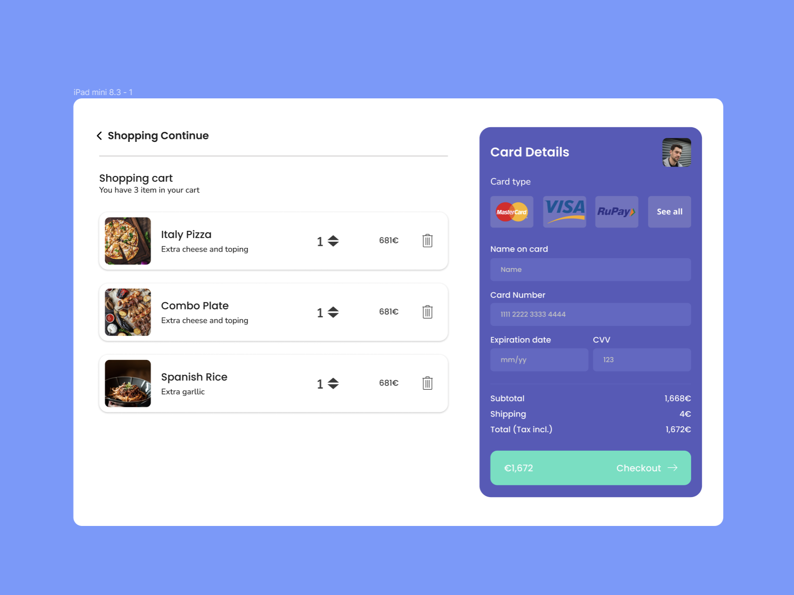

# **Exercicio Shopping Cart**

O Objetivo de este exercicio é recriarmos o design presente no seguinte figma:



[Link para o figma](<https://www.figma.com/file/gN4U2iQYMcEPEszljRop0y/Shopping-Cart-(Community)?type=design&node-id=7%3A2&mode=design&t=1WHDanpYxdol7Skd-1>)

## **Objetivo**

Neste exercicio já possuem a estrutura inicial mas é necessario recriar a secção do pagamento.

Pontos a ter em conta:

- Descreve a tua interface com recurso a componentes functionais de React
- Separa os componentes em estrutura que aches logica para esta secção
- Todos os recursos de imagens se encontram na pasta assets (Image, Icons) - Podes ver como se utilizam os assets nos seguintes componentes `BackAction` & `CheckoutProductItem`
- Cria os estilos que achares necessarios para cada componente

## Clonar projeto

Para poderem clonar este projeto entrem no terminal na pasta onde pretendem clonar e façam os seguintes passos:

```shell
git clone https://github.com/IgnorePT/shopping-cart-menu

#Entrar na pasta do projeto
cd shopping-cart-menu

# Instalar dependencias
npm i
```

## Como correr o projeto

Projeto criado com recurso ao VITE.

```shell
npm run dev
```
